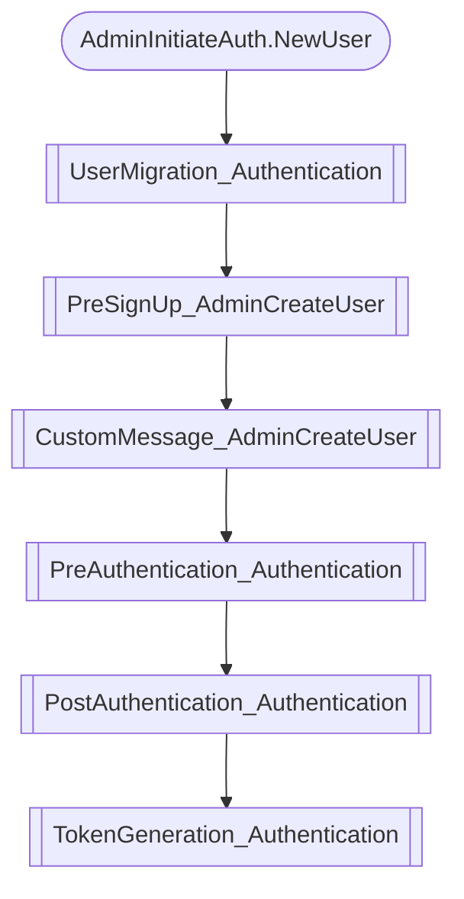

# Cognito Trigger Mapper

A utility project to help with designing [cognito-local](https://github.com/jagregory/cognito-local).

This project creates a Lambda function and attaches it to every trigger on an Amazon Cognito User Pool. The Lambda
writes any events it receives to an "events" DynamoDB table, and responds to the triggers with stub responses from a
"stubs" DynamoDB table.

There are a set of "scenarios" in the `scripts/cognito/scenarios` directory which exercise the User Pool in different
ways and prints out which triggers were executed and in what order.

For example, when calling `AdminInitiateAuth` for a user who doesn't exist, the follow triggers can execute:



## Running a scenario

First, deploy the CDK stack. You only need to do this once: `yarn deploy` (you'll need credentials to an AWS account for
this to work).

Next, use the CLI and it will prompt you for arguments: `scripts/cognito/run.ts`

`--eventsTableName`, `--stubsTableName`, and `--userPoolId` are all outputs of the CDK stack.

`--scenario` needs to be one of the scenarios (the CLI will list them).

## Adding a new scenario

Look at the existing scenarios for inspiration. The structure of a scenario is:

```ts
const scenario: Scenario = {
  name: "scenario name",
  stubs: {},
  setup(userPoolId) {},
  exec(args) {},
};
```

- `name` is the scenario name, used in the CLI.
- `stubs` are key-value pairs of the `triggerSource` (e.g. `CustomMessage_AdminCreateUser`) and the payload returned in
  in the `response` object of the lambda. Many triggers don't need a response, but we explicitly require a stub for each
  for the sake of clarity. If you don't know what stubs are needed, just run the scenario and it will tell you what's
  missing.
- `setup` is used to get the user pool into the state you need to run your scenario. If your scenario is supposed to act
  on an existing user, create the user in `setup`. Return an object from setup to have those resources cleaned up after
  the scenario has run. After setup any events that have already been raised will be cleared ready for the scenario to
  run.
- `exec` is your actual scenario's execution, run anything in here that you want to see triggers recorded. Return an
  object from exec if you need anything cleaned up.
